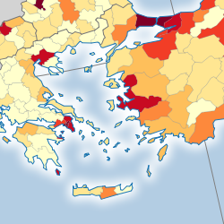
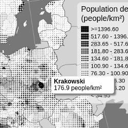

# eurostat-map.js

Reusable library for web maps showing [Eurostat](https://ec.europa.eu/eurostat) data.

[](https://bl.ocks.org/jgaffuri/raw/0d6e1b1c6f9e1297829f38b9c37737fe/)
[](https://bl.ocks.org/jgaffuri/raw/cf5f187bd195f9c8771a1a3a4898079a/)
[](https://bl.ocks.org/jgaffuri/raw/c8b99b207bb80a923bf1fd19f5d6de7e/)

## Examples

* [Population density map](https://bl.ocks.org/jgaffuri/raw/0d6e1b1c6f9e1297829f38b9c37737fe/) (see [the code](https://bl.ocks.org/jgaffuri/0d6e1b1c6f9e1297829f38b9c37737fe))
* [Population density map with dot pattern](https://bl.ocks.org/jgaffuri/raw/c8b99b207bb80a923bf1fd19f5d6de7e/) (see [the code](https://bl.ocks.org/jgaffuri/c8b99b207bb80a923bf1fd19f5d6de7e))
* [Population map with proportional circles](https://bl.ocks.org/jgaffuri/raw/cf5f187bd195f9c8771a1a3a4898079a/) (see [the code](https://bl.ocks.org/jgaffuri/cf5f187bd195f9c8771a1a3a4898079a))

## Quick start

First, add the various required libraries, replacing *X.Y.Z* with the version number of the last release (see [here](https://github.com/eurostat/eurostat.js/releases)):

```html
<script src="https://d3js.org/d3.v4.min.js"></script>
<script src="https://d3js.org/d3-queue.v3.min.js"></script>
<script src="https://d3js.org/topojson.v1.min.js"></script>
<script src="https://d3js.org/d3-color.v1.min.js"></script>
<script src="https://d3js.org/d3-interpolate.v1.min.js"></script>
<script src="https://d3js.org/d3-scale-chromatic.v1.min.js"></script>
<script src="https://cdnjs.cloudflare.com/ajax/libs/d3-legend/2.25.6/d3-legend.min.js"></script>

<script src="https://cdn.jsdelivr.net/npm/jsonstat@0.13.3/json-stat.js"></script>

<script src="https://cdn.jsdelivr.net/gh/eurostat/eurostat.js@X.Y.Z/js/eurostat-lib.js"></script>
<script src="https://cdn.jsdelivr.net/gh/eurostat/eurostat.js@X.Y.Z/js/eurostat-map.js"></script>
<script src="https://cdn.jsdelivr.net/gh/eurostat/eurostat.js@X.Y.Z/js/eurostat-tooltip.js"></script>
```

Then, add a SVG element where the map should appear:

```html
<svg id="map"></svg>
```

And finally, specify the map content and style in javascript. The example below draws a map showing population density in 2016 from Eurostat database *[demo_r_d3dens](http://appsso.eurostat.ec.europa.eu/nui/show.do?dataset=demo_r_d3dens)*. See [the result](https://bl.ocks.org/jgaffuri/raw/0d6e1b1c6f9e1297829f38b9c37737fe/) and [the code](https://bl.ocks.org/jgaffuri/0d6e1b1c6f9e1297829f38b9c37737fe).

```javascript
EstLib.map()
.width(1000)
.datasetCode("demo_r_d3dens")
.filters({time : 2016})
.unitText("people/km²")
.legendTitleText("Population density (people/km²)")
.legendBoxHeight(210)
.legendBoxWidth(190)
.build();
```


## Documentation

### Overall parameters

| Method | Type | Default value | Description |
| --- | --- | --- | --- |
| svgId | String | "map" | The id of the SVG element where to draw the map. |
| type | String | "ch" | The type of map. Possible values are "ch" for choropleth maps and "ps" for proportional symbols. |
| width | int | 800 | The width of the map in pixel. |
| datasetCode | String | "demo_r_d3dens" for population density map. | The Eurostat database code to retrieve the statistical figures. See [here](https://ec.europa.eu/eurostat/data/database) to find them. |
| filters | Object | { lastTimePeriod : 1 } |  The Eurostat dimension codes to filter the statistical figures. See [here](https://ec.europa.eu/eurostat/data/database) or [here](https://ec.europa.eu/eurostat/web/json-and-unicode-web-services/getting-started/query-builder) to find them.  |
| precision | int | 2 | The precision of the statistical figures to retrieve (number of decimal places). |
| scale | String | "20M" | The simplification level of the map, among "10M", "20M", "60M". |
| scaleExtent | Array | [1,4] | The zoom extent. Set to null to forbid zooming. |
| proj | String | "3035" | The map projection code. Possible values are given in [Nuts2json](https://github.com/eurostat/Nuts2json/blob/gh-pages/README.md)  |
| nutsLvl | int | 3 | The nuts level to show on the map, from 0 (national level) to 3 (local level) |
| NUTSyear | int | 2013 | The version of the NUTS dataset to use. Possible values are given in [Nuts2json](https://github.com/eurostat/Nuts2json/blob/gh-pages/README.md) |
| lg | String | "en" | The language. |
| showTooltip | boolean | true | A boolean value indicating if tooltip should appear on the map. |
| unitText | String | "" | The text to display to show the unit in the tooltip |

### For choropleth maps (when type="ch")

| Method | Type | Default value | Description |
| --- | --- | --- | --- |
| classifMethod | String | "quantile" | The classification method. Possible values are "quantile", "equinter" for equal intervals, and "threshold" for user defined threshol (see threshold method). |
| threshold | Array | [0] | classifMethod="threshold", the breaks of the classification. |
| makeClassifNice | boolean | true | Make nice break values. Works only for classifMethod="equinter". |
| clnb | int | 7 | The number of classes. |
| colorFun | thins or function | d3.interpolateYlOrRd | The color function, as defined in https://github.com/d3/d3-scale-chromatic/ |
| classToFillStyle | Function | See description | A function returning a fill style for each class number. The default values is the function returned by *EstLib.getColorLegend(colorFun())*. |
| filtersDefinitionFun | Function | function() {} | A function defining SVG filter elements. To be used to defined fill patterns.  |
| noDataFillStyle | String | "lightgray" | The fill style to be used for regions where no data is available. |
| noDataText | String | "No data" | The text to show for regions where no data is available.  |

### For proportional symbol map (when type="ps")

| Method | Type | Default value | Description |
| --- | --- | --- | --- |
| psMaxSize | number | 30 | The maximum size, in pixel. |
| psMinSize | number | 0.8 | The minimum size, for non null values, in pixel. |
| psMinValue | number | 0 | The minimum value of the range domain. |
| psFill |  | String | "#B45F04" | The fill color or pattern of the symbol. |
| psFillOpacity | number | 0.7 | The opacity of the symbol, from 0 to 1. |
| psStroke | String | "#fff" | The stroke color of pattern of the symbol. |
| psStrokeWidth | number | 0.5 | The width of the stroke. |

### Specify map style

| Method | Type | Default value | Description |
| --- | --- | --- | --- |
| nutsrgFillStyle | String | "#eee" |  |
| nutsrgSelectionFillStyle | String | "#purple" |  |
| nutsbnStroke | String | {0:"#777", 1:"#777", 2:"#777", 3:"#777", oth:"#444", co:"#1f78b4"} |  |
| nutsbnStrokeWidth | number | {0:1, 1:0.2, 2:0.2, 3:0.2, oth:1, co:1} |  |
| cntrgFillStyle | String | "lightgray" |  |
| cntrgSelectionFillStyle | String | "darkgray" |  |
| cntbnStroke | String | "#777" |  |
| cntbnStrokeWidth | number | 1 |  |
| drawGraticule | boolean | true |  |
| graticuleStroke | String | "gray" |  |
| graticuleStrokeWidth | number | 1 |  |
| seaFillStyle | String | "#b3cde3" |  |
| drawCoastalMargin | boolean | true |  |
| coastalMarginWidth | number | 12 |  |
| coastalMarginStdDev | number | 12 |  |
| coastalMarginColor | String | "white" |  |

### Specify the legend

| Method | Type | Default value | Description |
| --- | --- | --- | --- |
| showLegend | boolean | true |  |
| legendFontFamily | String | EstLib.fontFamilyDefault |  |
| legendTitleText | String | "Legend" |  |
| legendTitleFontSize | int | 20 |  |
| legendTitleWidth | int | 40 |  |
| legendAscending | String | true |  |
| legendCellNb | int | 4 |  |
| legendLabelWrap | int | 140 |  |
| legendLabelDecNb | int | 2 |  |
| legendLabelOffset | int | 5 |  |
| legendLabelFontSize | int | 15 |  |
| legendLabelDelimiter | String | " - " |  |
| legendShapeWidth | int | 20 |  |
| legendShapeHeight | int | 16 |  |
| legendShapePadding | int | 2 |  |
| legendBoxMargin | int | 10 |  |
| legendBoxPadding | int | 10 |  |
| legendBoxCornerRadius | int | 10 |  |
| legendBoxOpacity | number | 0.5 |  |
| legendBoxFill | String | "white" |  |
| legendBoxWidth | int | 250 |  |
| legendBoxHeight | int | 350 |  |

### Methods to update the map

| Method | Returns | Description |
| --- | --- | --- |
| build | this |  |
| updategeoData | this |  |
| updateStatData | this |  |
| buildMapTemplate | this |  |
| updateStatValues | this |  |
| updateClassificationAndStyle | this |  |
| updateLegend | this |  |
| updateStyle | this |  |

### Others

| Method | Returns | Description |
| --- | --- | --- |
| set | this |  |
| getTime | String |  |

Anything missing? Feel free to [ask](https://github.com/eurostat/eurostat.js/issues/new) !

## Technical details

Maps based on [NUTS regions](http://ec.europa.eu/eurostat/web/nuts/overview) rely on [Nuts2json API](https://github.com/eurostat/Nuts2json/blob/gh-pages/README.md) and [TopoJSON](https://github.com/mbostock/topojson/wiki) format. Statistical data are accessed using [Eurostat REST webservice](http://ec.europa.eu/eurostat/web/json-and-unicode-web-services/getting-started/rest-request) for [JSON-stat](https://json-stat.org/) data. The data are decoded and queried using [JSON-stat library](https://json-stat.com/). Maps are rendered as SVG maps using [D3.js library](https://d3js.org/).

## Support and contribution

Feel free to [ask support](https://github.com/eurostat/eurostat.js/issues/new), fork the project or simply star it (it's always a pleasure).
